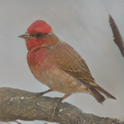
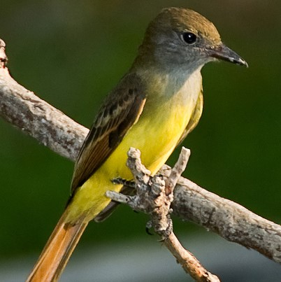

<!-- <table><tr>
<td></td>
<td></td>
<td></td>
</tr></table> -->



### Introduction
<small>
An estimated half of the world’s languages do
not have a written form, making it impossible
for these languages to benefit from any existing
text-based technologies. In this project, a speech-to-image generation (S2IG)
framework is proposed which translates speech descriptions
to photo-realistic images without using
any text information, thus allowing unwritten languages
to potentially benefit from this technology.
The proposed S2IG framework, named S2IGAN,
consists of a speech embedding network (SEN)
and a relation-supervised densely-stacked generative
model (RDG). SEN learns the speech embedding
with the supervision of the corresponding
visual information. Conditioned on the speech
embedding produced by SEN, the proposed RDG
synthesizes images that are semantically consistent
with the corresponding speech descriptions.
</small>

### Model structure
#### Speech Embedding Network (SEN)
<!--  -->

        

          
        

<small>

Given an image-speech pair, SEN tries to find a common
space for both modalities, so that we can minimize the modality
gap and obtain visually-grounded speech embeddings. As
shown in the Figure, SEN is a dual encoder framework, including
an image encoder and a speech encoder.

**The image encoder (IED)** adopts the Inception-v3 pre-trained on ImageNet to extract visual features. On top of it, a single-layer linear layer is employed to convert the visual feature to a common space of visual and speech embeddings. 

**The speech encoder (SED)** consists of a two-layer 1-D convolution block, two bi-directional gated recurrent units (GRU) and a self-attention layer. The 1-D convolutional block consisted of two 1-D convolutional layers with 40 input, 64 hidden and 128 output channels. The size of the hidden layer
of the bi-directional GRU was 512 and the size of the output was 1024 by concatenating the bidirectional representations. 
</small>

#### Relation-supervised Densely-stacked Generative Model (RDG)


<small>
After learning the visually-grounded and class-discriminative speech embedding, we employ RDG to generate images conditioned on this speech embedding. RDG consists of two sub-modules, which are a Densely-stacked Generator (DG) and a Relation Supervisor (RS). 

</small>

#### Results
##### Comparison

<table><tr>
<td>

 

Ground Truth 

StackGAN-v2 (T2IG) 

StackGAN-v2 (S2IG) 

S2IGAN (S2IG) 

</td>

<td>

<audio controls style="width:120px;height:32px">
<source src="01_Groundtruth/audio/birds/01.wav" type="audio/mpeg">
Your browser does not support the audio element.
</audio>
</td>

<td>

<audio controls style="width:120px;height:32px">
<source src="01_Groundtruth/audio/birds/02.wav" type="audio/mpeg">
Your browser does not support the audio element.
</audio>
</td>

<td>

<audio controls style="width:120px;height:32px">
<source src="01_Groundtruth/audio/birds/03.wav" type="audio/mpeg">
Your browser does not support the audio element.
</audio>
</td>

<td>

<audio controls style="width:120px;height:32px">
<source src="01_Groundtruth/audio/birds/04.wav" type="audio/mpeg">
Your browser does not support the audio element.
</audio>
</td>

<td>

<audio controls style="width:120px;height:32px">
<source src="01_Groundtruth/audio/birds/05.wav" type="audio/mpeg">
Your browser does not support the audio element.
</audio>
</td>
</tr></table>

<table><tr>

<td>

 

Ground Truth 

StackGAN-v2 (T2IG) 

StackGAN-v2 (S2IG) 

S2IGAN (S2IG) 

</td>

<td>

<audio controls style="width:120px;height:32px">
<source src="01_Groundtruth/audio/flowers/01.wav" type="audio/mpeg">
Your browser does not support the audio element.
</audio>
</td>

<td>

<audio controls style="width:120px;height:32px">
<source src="01_Groundtruth/audio/flowers/02.wav" type="audio/mpeg">
Your browser does not support the audio element.
</td>

<td>

<audio controls style="width:120px;height:32px">
<source src="01_Groundtruth/audio/flowers/03.wav" type="audio/mpeg">
Your browser does not support the audio element.
</td>
</td>

<td>

<audio controls style="width:120px;height:32px">
<source src="01_Groundtruth/audio/flowers/04.wav" type="audio/mpeg">
Your browser does not support the audio element.
</td>
</td>

<td>

<audio controls style="width:120px;height:32px">
<source src="01_Groundtruth/audio/flowers/05.wav" type="audio/mpeg">
Your browser does not support the audio element.
</td>
</td>

</tr></table>

##### Ability to catch subtle semantic differences
<small>
The following images were generated by S2IGAN conditioned on speech descriptions that have subtle differences.
</small>

<table><tr>
<td>

<audio controls style="width:200px;height:32px">
<source src="yellow_brown.wav" type="audio/mpeg">
Your browser does not support the audio element.
</audio></td>
<td>

<audio controls style="width:200px;height:32px">
<source src="yellow_black.wav" type="audio/mpeg">
Your browser does not support the audio element.
</audio></td>
<td>

<audio controls style="width:200px;height:32px">
<source src="yellow_blue.wav" type="audio/mpeg" >
Your browser does not support the audio element.
</audio></td>
</tr></table>

<table><tr>
<td>

<audio controls style="width:200px;height:32px">
<source src="red_brown.wav" type="audio/mpeg">
Your browser does not support the audio element.
</audio></td>
<td>

<audio controls style="width:200px;height:32px">
<source src="red_black.wav" type="audio/mpeg">
Your browser does not support the audio element.
</audio></td>
<td>

<audio controls style="width:200px;height:32px">
<source src="red_blue.wav" type="audio/mpeg" >
Your browser does not support the audio element.
</audio></td>
</tr></table>

<table><tr>
<td>

<audio controls style="width:200px;height:32px">
<source src="grey_brown.wav" type="audio/mpeg">
Your browser does not support the audio element.
</audio></td>
<td>

<audio controls style="width:200px;height:32px">
<source src="grey_black.wav" type="audio/mpeg">
Your browser does not support the audio element.
</audio></td>
<td>

<audio controls style="width:200px;height:32px">
<source src="grey_blue.wav" type="audio/mpeg" >
Your browser does not support the audio element.
</audio></td>
</tr></table>

#####  Component analysis

<small>

**Effect of densely-stacked structure of DG** We evaluated the effect of the densely-stacked structures by changing it with the traditional stacked structures as in StackGAN-v2 (see S2IGAN w/o Dense in Table 1). Comparing the results to S2IGAN, S2IGAN w/o Dense shows a performance drop for most evaluation metrics, see $e.g.,$ the decrease in mAP for both the CUB and the Oxford-102 datasets. These results confirm the effectiveness of the proposed densely-stacked structure for image generation. 

**Effect of RS** The effect of the relation supervisor on training the generators can be observed by comparing the performances of S2IGAN and S2IGAN w/o RS. The results show that the RS module leads to improvements in both mAP and FID for both datasets, $e.g.$, RS increases the mAP from 12.86 to 13.40 and decreases the FID from 53.24 to 48.64 on the Oxford-102 dataset. These results indicate the effectiveness of RS on ensuring the semantic consistency of the synthesized images with the corresponding speech descriptions. 

**Effect of SEN** The effect of SEN on our S2IGAN is investigated by comparing S2IGAN with S2IGAN w/o SEN. When the speech encoder (SED) was not pre-trained in SEN, the generation model (S2IGAN w/o SEN) shows a much worse performance, $e.g.,$ without SEN, mAP drops from 9.04 to 2.91 on the CUB dataset. Finally, we conducted an experiment to train S2IGAN in an end-to-end manner, however, the performance did not show an improvement (S2IGAN end-to-end). These results show the importance of the pre-learned speech embedding provided by SEN. 

</small>

<table class="tg">
<caption>Table 1: Component analysis of S2IGAN; w/o means without. The best results are shown in bold.</caption>
  <tr>
    <th class="tg-0pky">Dataset</th>
    <th class="tg-c3ow" colspan="3">CUB (Bird)</th>
    <th class="tg-c3ow" colspan="3">Oxford-102 (Flower)</th>
  </tr>
  <tr>
    <td class="tg-0pky" width="20%">Evaluation Metric </td>
    <td class="tg-c3ow" width="12%">mAP</td>
    <td class="tg-c3ow" width="12%">FID</td>
    <td class="tg-c3ow" width="12%">IS</td>
    <td class="tg-c3ow" width="12%">mAP</td>
    <td class="tg-c3ow" width="12%">FID</td>
    <td class="tg-c3ow" width="20%">IS</td>
  </tr>
  <tr>
    <td class="tg-0pky">S2IGAN w/o Dense </td>
    <td class="tg-c3ow">8.66</td>
    <td class="tg-c3ow">17.58</td>
    <td class="tg-c3ow">4.19</td>
    <td class="tg-c3ow">13.13</td>
    <td class="tg-c3ow">64.37</td>
    <td class="tg-c3ow">3.68 &#177  0.05</td>
  </tr>
  <tr>
    <td class="tg-0pky">S2IGAN w/o RS</td>
    <td class="tg-c3ow">8.54</td>
    <td class="tg-c3ow">15.59</td>
    <td class="tg-c3ow">4.14</td>
    <td class="tg-c3ow">12.86</td>
    <td class="tg-c3ow">53.24</td>
    <td class="tg-c3ow"><b>3.70 &#177 0.08</b></td>
  </tr>
  <tr>
    <td class="tg-0pky">S2IGAN w/o SEN</td>
    <td class="tg-c3ow">2.91</td>
    <td class="tg-c3ow">19.56</td>
    <td class="tg-c3ow">3.49</td>
    <td class="tg-c3ow">7.38</td>
    <td class="tg-c3ow">67.60</td>
    <td class="tg-c3ow">2.77 &#177 0.04</td>
  </tr>
  <tr>
    <td class="tg-0pky">S2IGAN end-to-end</td>
    <td class="tg-c3ow">7.38</td>
    <td class="tg-c3ow">21.54</td>
    <td class="tg-c3ow">4.29</td>
    <td class="tg-c3ow">12.47</td>
    <td class="tg-c3ow">51.88</td>
    <td class="tg-c3ow">3.55 &#177 0.08</td>
  </tr>
  <tr>
    <td class="tg-0pky">S2IGAN</td>
    <td class="tg-c3ow"><b>9.04</b></td>
    <td class="tg-c3ow"><b>14.50</b></td>
    <td class="tg-c3ow"><b>4.29</b></td>
    <td class="tg-c3ow"><b>13.40</b></td>
    <td class="tg-c3ow"><b>48.64</b></td>
    <td class="tg-c3ow">3.55 &#177 0.04</td>
  </tr>
</table>

<small>

**Effect of the distinctive loss in SEN** We investigated the effect of the distinctive loss $\mathcal{L}_d$ for training SEN. The SEN module was evaluated using a cross-modal image retrieval task. Specifically, we used speech descriptions to retrieve the corresponding images with the same class. Retrieval performance was evaluated with the mean Average Precision (mAP). Higher mAP means a better retrieval result, indicating better performance on embedding speech information. The results are shown in Table 2. As can be seen, SEN without using $\mathcal{L}_d$ for training shows a performance drop in terms of mAP on both datasets. Importantly, a better performance of SEN always led to an increase in the performance of S2IGAN, showing the importance of learning a good speech embedding for the task of image generation.  
</small>

<table class="tg">
<caption>Table 2: Effect of the distinctive loss <i>Ld</i> in SEN. mAP of SEN is
calculated on the real test images.</caption>
  <tr>
    <th class="tg-c3ow" rowspan="2" width="20%">Dataset</th>
    <th class="tg-c3ow" rowspan="2"width="10%"><i>Ld</i></th>
    <th class="tg-c3ow">SEN</th>
    <th class="tg-c3ow" colspan="3">S2IGAN</th>
  </tr>
  <tr>
    <td class="tg-c3ow" width="12%">mAP</td>
    <td class="tg-c3ow" width="12%">mAP</td>
    <td class="tg-c3ow" width="12%">FID</td>
    <td class="tg-c3ow" width="12%">IS</td>
  </tr>
  <tr>
    <td class="tg-c3ow" rowspan="2">CUB (Bird)</td>
    <td class="tg-c3ow">w/o</td>
    <td class="tg-c3ow">23.68</td>
    <td class="tg-c3ow">6.80</td>
    <td class="tg-c3ow">16.66</td>
    <td class="tg-c3ow">4.19 &#177 0.05</td>
  </tr>
  <tr>
    <td class="tg-c3ow">w/</td>
    <td class="tg-7btt">24.24</td>
    <td class="tg-7btt">9.04</td>
    <td class="tg-7btt">14.50</td>
    <td class="tg-7btt">4.29 &#177 0.04</td>
  </tr>
  <tr>
    <td class="tg-c3ow" rowspan="2">Oxford-102 (Flower)</td>
    <td class="tg-c3ow">w/o</td>
    <td class="tg-c3ow">41.85</td>
    <td class="tg-c3ow">10.03</td>
    <td class="tg-c3ow">69.47</td>
    <td class="tg-c3ow">3.35 &#177 0.08</td>
  </tr>
  <tr>
    <td class="tg-c3ow">w/</td>
    <td class="tg-7btt">41.86</td>
    <td class="tg-7btt">13.40</td>
    <td class="tg-7btt">48.64</td>
    <td class="tg-7btt">3.55 &#177 0.08</td>
  </tr>
</table>

<small>

To better understand the role of the loss function, we visualized the speech feature distributions produced by SEN trained with and without $\mathcal{L}_d$ using t-SNE. It shows that the use of $\mathcal{L}_d$ increases the distance between different classes, which is important to create semantic-discriminative speech embeddings, $e.g.,$ after training SEN using $\mathcal{L}_d$, class 112 was no longer mixed with other classes. So, both the objective results and the visualization show that $\mathcal{L}_d$ is critical for learning better speech embeddings, which further helps S2IGAN to generate better semantically-consistent images.

</small>



### Paper
The paper was released on arXiv: https://arxiv.org/abs/2005.06968

### Code 
The source code will be released soon: https://github.com/xinshengwang/S2IGAN.